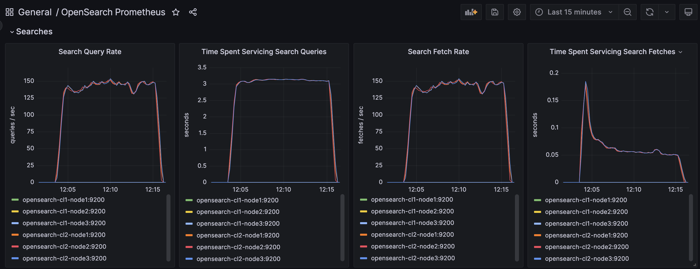

# Week 4 Project

## 1. Created docker-compose-w4.yml to spin up 2 clusters of 3 nodes each.

```bash
curl -XGET -u 'admin:admin' -k 'https://localhost:9201'
{
  "name" : "opensearch-cl2-node1",
  "cluster_name" : "opensearch-cluster-cl2",
  "cluster_uuid" : "HJrY59mxQ_OLEZlD5HQ2ow",
  "version" : {
    "distribution" : "opensearch",
    "number" : "2.6.0",
    "build_type" : "tar",
    "build_hash" : "7203a5af21a8a009aece1474446b437a3c674db6",
    "build_date" : "2023-02-24T18:58:37.352296474Z",
    "build_snapshot" : false,
    "lucene_version" : "9.5.0",
    "minimum_wire_compatibility_version" : "7.10.0",
    "minimum_index_compatibility_version" : "7.0.0"
  },
  "tagline" : "The OpenSearch Project: https://opensearch.org/"
}
```

```bash
curl -XGET -u 'admin:admin' -k 'https://localhost:9200'
{
  "name" : "opensearch-cl1-node1",
  "cluster_name" : "opensearch-cluster-cl1",
  "cluster_uuid" : "2O0U_P5yS8yNpAh2nt_YeQ",
  "version" : {
    "distribution" : "opensearch",
    "number" : "2.6.0",
    "build_type" : "tar",
    "build_hash" : "7203a5af21a8a009aece1474446b437a3c674db6",
    "build_date" : "2023-02-24T18:58:37.352296474Z",
    "build_snapshot" : false,
    "lucene_version" : "9.5.0",
    "minimum_wire_compatibility_version" : "7.10.0",
    "minimum_index_compatibility_version" : "7.0.0"
  },
  "tagline" : "The OpenSearch Project: https://opensearch.org/"
}
```

opensearch-cl1-node3 is the cluster manager for the first cluster.

Number of CPUs for both cluster:


Cluster metrics for both clusters:


## 2. You must be able to snapshot and restore the entire cluster

Added snapshot volume to each node in each cluster, and added it's path as an environment variable in the docker-compose file.


## 3. Be able to monitor all the nodes and containers in each cluster:

a) Update the promethues config to scrape the new node names. Change the target list to reflect the new names.
b) Change all instances of regex matching for nodes in grafana config to use the new node names.
    Replace `\"opensearch-node.*\"` with `\"opensearch-cl[0-9]-node-[0-9]\"`
c) Update the install prometheus plugin script to use the new node names.

## 4. Designate one cluster as the leader, and have the second cluster do cross-cluster replication.

### Get leader cluster IP

```bash
docker inspect -f '{{range.NetworkSettings.Networks}}{{.IPAddress}}{{end}}' opensearch-cl1-node1
```

Do for each node in the leader cluster.

### Set up cross-cluster replication

```bash
curl -XPUT -k -H 'Content-Type: application/json' -u 'admin:admin' 'https://localhost:9201/_cluster/settings?pretty' -d '
{
  "persistent": {
    "cluster": {
      "remote": {
        "my-connection-alias": {
          "seeds": ["192.168.112.10:9300","192.168.112.5:9300","192.168.112.8:9300"]
        }
      }
    }
  }
}'

{
  "acknowledged" : true,
  "persistent" : {
    "cluster" : {
      "remote" : {
        "my-connection-alias" : {
          "seeds" : [
            "192.168.112.10:9300",
            "192.168.112.5:9300",
            "192.168.112.8:9300"
          ]
        }
      }
    }
  },
  "transient" : { }
}
```

### Create index in leader cluster

```bash
curl -k -X PUT -u admin:admin https://localhost:9200/bbuy_products -H 'Content-Type: application/json' -d @bbuy_products.json

{
  "acknowledged" : true,
  "shards_acknowledged" : true,
  "index" : "bbuy_products"
}
```

### Start replication from the follower cluster

```bash
curl -XPUT -k -H 'Content-Type: application/json' -u 'admin:admin' 'https://localhost:9201/_plugins/_replication/bbuy_products/_start?pretty' -d '
{
   "leader_alias": "my-connection-alias",
   "leader_index": "bbuy_products",
   "use_roles":{
      "leader_cluster_role": "all_access",
      "follower_cluster_role": "all_access"
   }
}'

{
  "acknowledged" : true
}
```

### Verify replication

```bash
curl -XGET -k -u 'admin:admin' 'https://localhost:9201/_plugins/_replication/bbuy_products/_status?pretty'

{
  "status" : "SYNCING",
  "reason" : "User initiated",
  "leader_alias" : "my-connection-alias",
  "leader_index" : "bbuy_products",
  "follower_index" : "bbuy_products",
  "syncing_details" : {
    "leader_checkpoint" : -1,
    "follower_checkpoint" : -1,
    "seq_no" : 0
  }
}
```

```bash
curl -k -X GET -u admin:admin https://localhost:9200/_cat/indices?v
health status index                        uuid                   pri rep docs.count docs.deleted store.size pri.store.size
green  open   bbuy_products                o7scAuoTTOKuT2PUpqSpgw   1   2          0            0       624b           208b
```

```bash
curl -k -X GET -u admin:admin https://localhost:9201/_cat/indices?v
health status index                        uuid                   pri rep docs.count docs.deleted store.size pri.store.size
green  open   bbuy_products                3I2vSHxhRLm7GtKqWRG_Tw   1   2          0            0       624b           208b
```

## 5. Indexing and querying data on both clusters

### a) Indexing all the Best Buy Data and it being Replicated to the second cluster

```bash
poetry shell
export BBUY_DATA=../datasets/product_data/products
python index.py -s $BBUY_DATA -w 8 -b 500

INFO:Indexing ../datasets/product_data/products to bbuy_products with 8 workers, refresh_interval of -1 to host localhost with a maximum number of docs sent per file per worker of 200000 and 500 per batch.
INFO:Done. 1275077 were indexed in 6.599342440283333 minutes.  Total accumulated time spent in `bulk` indexing: 26.632439888649987 minutes
```

Image of metrics during indexing:

)


### b) Querying the data on both clusters


#### Query the replicated index on the follower cluster

```bash
export BBUY_QUERIES=/Users/jessica-g/Documents/search/corise/search_engineering/search_engineering/datasets           
python ./query.py -q $BBUY_QUERIES/train.csv -w 4 -m 25000 -p 9201

INFO:WN: 1: Finished running 25000 queries in 11.732489502083332 minutes
INFO:Query worker finished in time: 11.732489502083332
INFO:WN: 0: Finished running 25000 queries in 11.759362102783333 minutes
INFO:Query worker finished in time: 11.759362102783333
INFO:WN: 3: Finished running 25000 queries in 11.76641561945 minutes
INFO:Query worker finished in time: 11.76641561945
INFO:WN: 2: Finished running 25000 queries in 11.785170256933334 minutes
INFO:Query worker finished in time: 11.785170256933334
```

Image of metrics during query of follower cluster:



#### Query the index on the leader cluster

```bash
export BBUY_QUERIES=/Users/jessica-g/Documents/search/corise/search_engineering/search_engineering/datasets           
python ./query.py -q $BBUY_QUERIES/train.csv -w 4 -m 25000 -p 9200

INFO:WN: 1: Finished running 25000 queries in 13.406457145833333 minutes
INFO:WN: 0: Finished running 25000 queries in 13.409860296533335 minutes
INFO:Query worker finished in time: 13.406457145833333
INFO:Query worker finished in time: 13.409860296533335
INFO:WN: 3: Finished running 25000 queries in 13.462220328466666 minutes
INFO:Query worker finished in time: 13.462220328466666
INFO:WN: 2: Finished running 25000 queries in 13.495116327766668 minutes
INFO:Query worker finished in time: 13.495116327766668
```

Image of metrics during query of leader cluster:

